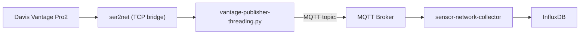
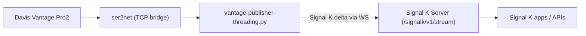

# Vantage Publisher

`vantage-publisher` reads live data from a Davis Vantage Pro2 console (via `ser2net` TCP), enriches the payload with station metadata and optional AirLink data, stores samples to CSV, and publishes messages to MQTT or directly to a Signal K server.

The threaded publisher (`vantage-publisher-threading.py`) is aligned with the newer PyVantagePro streaming approach used in `examples/14_stream.py` while keeping compatibility with this repository's existing `config.json` and `parameters.json` files.

## Features

- Persistent station stream with automatic reconnect
- Per-sample field filtering through `parameters.json`
- CSV persistence under `pathStorage/YYYY/MM/YYYY-MM-DD.csv`
- MQTT publishing with offline store-and-forward (SQLite queue)
- Selectable MQTT payload format: `flat`, `geojson`, `signalk`
- Optional AirLink merge (cached on interval)
- Graceful shutdown on `SIGINT`/`SIGTERM`

## Requirements

- Python 3.8+
- Access to a Vantage Pro2 console exposed as `tcp:127.0.0.1:<usbPort>` (typically through `ser2net`)
- Optional MQTT broker (not required in direct Signal K mode)

Install dependencies:

```bash
python3 -m pip install -r requirements.txt
```

## Configuration

### `config.json` (current format, still supported)

```json
{
  "uuid": "it.uniparthenope.meteo.ws1",
  "name": "Centro Direzionale",
  "lon": 14.2845,
  "lat": 40.8569,
  "usbPort": 22222,
  "usbPollInterval": 1.0,
  "delay": 10,
  "timeout": 60,
  "pathStorage": "/storage/vantage-pro/",
  "mqttBroker": "broker.example.org",
  "mqttPort": 1883,
  "mqttUser": "",
  "mqttPass": "",
  "mqttQos": 1,
  "mqttFormat": "flat",
  "signalkServerUrl": "",
  "signalkToken": "",
  "signalkContext": "meteo.it.uniparthenope.meteo.ws1",
  "signalkPathMap": {},
  "offlineMaxMessages": 200000,
  "offlineMaxAgeSec": 604800,
  "airlinkIntervalSec": 300
}
```

Optional additional keys:

- `mqttKeepalive` (default `30`)
- `mqttReconnectSleep` (default `1.0`)
- `mqttSpoolFile` (default `<pathStorage>/mqtt_offline_queue.sqlite`)
- `mqttFormat`: `flat` (default), `geojson`, `signalk`
- `signalkServerUrl`: websocket URL for direct Signal K publishing (example: `ws://localhost:3000/signalk/v1/stream`)
- `signalkToken`: optional Signal K token for authenticated websocket
- `signalkContext`: context for Signal K deltas (default `meteo.<uuid>`)
- `signalkPathMap`: optional explicit map `{ "<field>": "<signalk.path>" }`

### `parameters.json`

`parameters.json` is a map of station field name to boolean:

- `true`: include field
- `false`: exclude field

If the file is missing, all fields are included.

## Running

```bash
python3 vantage-publisher-threading.py
```

## MQTT payload formats

### `flat` (default)

Legacy payload, same shape as the historical publisher:

```json
{
  "Datetime": "2026-02-24T10:15:40Z",
  "TempOut": 12.7,
  "WindSpeed": 3,
  "position": { "latitude": 40.8569, "longitude": 14.2845 },
  "name": "Centro Direzionale"
}
```

### `geojson`

Payload as GeoJSON `Feature`:

```json
{
  "type": "Feature",
  "geometry": {
    "type": "Point",
    "coordinates": [14.2845, 40.8569]
  },
  "properties": {
    "Datetime": "2026-02-22T22:15:40Z",
    "TempOut": 12.7,
    "WindSpeed": 3,
    "uuid": "it.uniparthenope.meteo.ws1",
    "name": "Centro Direzionale"
  }
}
```

### `signalk`

Payload as Signal K update:

```json
{
  "context": "meteo.it.uniparthenope.meteo.ws1",
  "updates": [
    {
      "timestamp": "2026-02-24T10:15:40Z",
      "values": [
        {
          "path": "navigation.position",
          "value": { "latitude": 40.8569, "longitude": 14.2845 }
        },
        { "path": "environment.outside.temperature", "value": 285.85 },
        { "path": "environment.wind.speedApparent", "value": 3 }
      ]
    }
  ]
}
```

Signal K mapping behavior:

- context: `meteo.<uuid>`
- `navigation.position`: station latitude/longitude
- standard paths are used when mapped (for example: `TempOut`, `HumOut`, `Barometer`, `WindSpeed`, `WindDir`, `TempIn`, `HumIn`)
- all other keys fallback to `environment.<key>`
- `signalkPathMap` overrides the path selection for mapped keys

When `mqttFormat = "signalk"`:

- If `signalkServerUrl` is set, publisher sends deltas directly to Signal K websocket (`/signalk/v1/stream`).
- If `signalkServerUrl` is empty, publisher sends Signal K delta JSON over MQTT topic `uuid`.

## Best integration with sensor-network-collector

This section documents the recommended setup between:

- `vantage-publisher-threading.py` (producer)
- `sensor-network-collector/main.py` (consumer)

Compatibility verification summary:

- `mqttFormat = "geojson"`: fully supported by collector (recommended)
- `mqttFormat = "flat"`: supported
- `mqttFormat = "signalk"`: currently not fully unpacked by collector (only top-level scalar keys are written)

### Recommended architecture



### Dataflow (recommended mode: `geojson`)

1. `vantage-publisher` reads live weather data from Vantage Pro2 via `tcp:127.0.0.1:<usbPort>`.
2. It filters fields using `parameters.json`, enriches payload with station identity/position and optional AirLink values.
3. It writes CSV files locally under `pathStorage`.
4. It publishes a GeoJSON packet to MQTT topic `<uuid>`.
5. `sensor-network-collector` subscribes to that topic and extracts:
   - fields from GeoJSON `properties`
   - tags from `properties.uuid`, `properties.name`, and geometry coordinates
6. Collector writes points to InfluxDB.

### Recommended `vantage-publisher/config.json`

Use `mqttFormat = "geojson"` for best interoperability with current collector behavior.

```json
{
  "uuid": "it.uniparthenope.meteo.ws1",
  "name": "Centro Direzionale",
  "lon": 14.2845,
  "lat": 40.8569,
  "usbPort": 22222,
  "usbPollInterval": 1.0,
  "delay": 10,
  "timeout": 60,
  "pathStorage": "/storage/vantage-pro/",
  "mqttBroker": "mqtt-broker.local",
  "mqttPort": 1883,
  "mqttUser": "",
  "mqttPass": "",
  "mqttQos": 1,
  "mqttFormat": "geojson",
  "offlineMaxMessages": 200000,
  "offlineMaxAgeSec": 604800,
  "airlinkIntervalSec": 300
}
```

Key points:

- `uuid` is both MQTT topic and station identity.
- `mqttBroker`/`mqttPort` must point to the same broker used by collector.
- `mqttFormat` should be `geojson` for best tag extraction in collector.

### Recommended `sensor-network-collector/config.json`

Set `mqtt_topic` to the station UUID (or a wildcard if you ingest multiple stations).

```json
{
  "log_level": "INFO",
  "influxdb_url": "http://influxdb.local:8086",
  "influxdb_token": "YOUR_TOKEN",
  "influxdb_org": "YOUR_ORG",
  "influxdb_bucket": "weather",
  "mqtt_address": "mqtt-broker.local",
  "mqtt_port": 1883,
  "mqtt_user": "",
  "mqtt_password": "",
  "mqtt_topic": "it.uniparthenope.meteo.ws1",
  "influx_measurement": "meteo",
  "skip_empty_fields": 1
}
```

Key points:

- `mqtt_address`/`mqtt_port` must match publisher broker settings.
- `mqtt_topic` should match publisher `uuid` for single-station ingestion.
- For multiple stations, use wildcard topic (for example `it.uniparthenope.meteo.#`).
- `skip_empty_fields = 1` is recommended in production.

### Operational best practices

- Keep station clock aligned (NTP on gateway/host) to improve timestamp quality.
- Keep `delay` and `usbPollInterval` coherent (typical: `delay >= usbPollInterval`).
- Use stable topic naming (`uuid`) and avoid changing it once dashboards are built.
- Prefer `geojson` unless/until collector adds native Signal K update decoding.

## Direct Signal K server integration (without sensor-network-collector)

This setup sends data directly from `vantage-publisher` to Signal K Server using websocket deltas.

Verification notes:

- Signal K server websocket endpoint `/signalk/v1/stream` accepts incoming JSON messages with `updates`.
- `vantage-publisher` now supports direct websocket push when:
  - `mqttFormat = "signalk"`
  - `signalkServerUrl` is configured

### Architecture



### Dataflow

1. `vantage-publisher` reads and filters station data.
2. It enriches payload with station position and optional AirLink values.
3. It builds a Signal K delta:
   - `context`: `signalkContext` (default `meteo.<uuid>`)
   - `updates[].values[].path`: from `signalkPathMap`, then standard mapping, else `environment.<field>`
4. It opens/reuses websocket connection to `signalkServerUrl`.
5. It pushes delta JSON to the Signal K stream endpoint.

### Recommended `vantage-publisher/config.json` for direct Signal K

```json
{
  "uuid": "it.uniparthenope.meteo.ws1",
  "name": "Centro Direzionale",
  "lon": 14.2845,
  "lat": 40.8569,
  "usbPort": 22222,
  "usbPollInterval": 1.0,
  "delay": 10,
  "timeout": 60,
  "pathStorage": "/storage/vantage-pro/",
  "mqttBroker": "",
  "mqttPort": 1883,
  "mqttUser": "",
  "mqttPass": "",
  "mqttQos": 1,
  "mqttFormat": "signalk",
  "signalkServerUrl": "ws://signalk.local:3000/signalk/v1/stream",
  "signalkToken": "OPTIONAL_TOKEN",
  "signalkContext": "meteo.it.uniparthenope.meteo.ws1",
  "signalkPathMap": {
    "TempOut": "environment.outside.temperature",
    "HumOut": "environment.outside.humidity",
    "Barometer": "environment.outside.pressure",
    "WindSpeed": "environment.wind.speedApparent",
    "WindDir": "environment.wind.angleApparent",
    "RainRate": "environment.rain.rate",
    "SolarRad": "environment.outside.solar.irradiance"
  },
  "offlineMaxMessages": 200000,
  "offlineMaxAgeSec": 604800,
  "airlinkIntervalSec": 300
}
```

### Signal K server side

1. Enable Signal K server and ensure websocket endpoint is reachable:
   - `ws://<host>:3000/signalk/v1/stream` (or `wss://...` with TLS)
2. If security is enabled, create/use a token and set `signalkToken`.
3. Start publisher and verify incoming deltas in Signal K Data Browser / stream consumers.

## Storage layout

- CSV samples: `<pathStorage>/<YYYY>/<MM>/<YYYY-MM-DD>.csv`
- MQTT offline queue DB: `<pathStorage>/mqtt_offline_queue.sqlite` (or `mqttSpoolFile` if configured)

## Docker

Build:

```bash
docker build -t vantage-publisher .
```

Run:

```bash
docker run --rm -it \
  -v $(pwd)/config.json:/app/config.json:ro \
  -v $(pwd)/parameters.json:/app/parameters.json:ro \
  -v /path/to/storage:/storage \
  vantage-publisher \
  python3 vantage-publisher-threading.py
```

## Notes

- MQTT is disabled automatically when `mqttBroker` or `mqttPort` is missing.
- AirLink lookup is skipped when `mqttBroker` is empty.
- The process logs to stdout; optionally set `LOG_FILE` to also write rotated file logs.

## License

Apache-2.0
