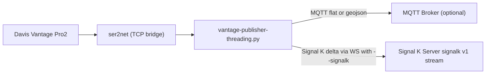

# Vantage Publisher

`vantage-publisher` reads live data from a Davis Vantage Pro2 console (via `ser2net` TCP), stores samples to CSV, publishes to MQTT, and can also publish directly to a Signal K server over websocket.

## Features

- Persistent station stream with automatic reconnect
- Per-sample field filtering via `parameters.json`
- CSV persistence under `pathStorage/YYYY/MM/YYYY-MM-DD.csv`
- MQTT publishing with offline store-and-forward (SQLite queue)
- Optional direct Signal K websocket publishing (`--signalk`)
- Optional AirLink merge (cached on interval)

## Requirements

- Python 3.8+
- Access to a Vantage Pro2 console exposed as `tcp:127.0.0.1:<usbPort>` (typically through `ser2net`)
- Optional MQTT broker
- Optional Signal K server (for `--signalk`)

Install dependencies:

```bash
python3 -m pip install -r requirements.txt
```

## Configuration

### `config.json`

```json
{
  "uuid": "it.uniparthenope.meteo.ws1",
  "name": "Centro Direzionale",
  "lon": 14.2845,
  "lat": 40.8569,
  "usbPort": 22222,
  "usbPollInterval": 1.0,
  "delay": 10,
  "timeout": 60,
  "pathStorage": "/storage/vantage-pro/",
  "mqttBroker": "mqtt-broker.local",
  "mqttPort": 1883,
  "mqttUser": "",
  "mqttPass": "",
  "mqttQos": 1,
  "mqttFormat": "flat",
  "signalkServerUrl": "ws://signalk.local:3000/signalk/v1/stream",
  "signalkToken": "",
  "signalkContext": "meteo.it.uniparthenope.meteo.ws1",
  "signalkPathMap": {},
  "offlineMaxMessages": 200000,
  "offlineMaxAgeSec": 604800,
  "airlinkIntervalSec": 300
}
```

Optional keys:

- `mqttFormat`: `flat` (default) or `geojson`
- `mqttKeepalive` (default `30`)
- `mqttReconnectSleep` (default `1.0`)
- `mqttSpoolFile` (default `<pathStorage>/mqtt_offline_queue.sqlite`)
- `signalkServerUrl`: websocket endpoint, usually `ws://<host>:3000/signalk/v1/stream`
- `signalkToken`: optional token for authenticated Signal K websocket
- `signalkContext`: delta context (default `meteo.<uuid>`)
- `signalkPathMap`: explicit field-to-path map for Signal K deltas (`{ "<field>": "<signalk.path>" }`)

### `parameters.json`

Map each field name to boolean:

- `true`: include field
- `false`: exclude field

If missing, all fields are included.

## Command line parameters

The script supports:

- `--config <path>`: config file path (default `config.json`)
- `--parameters <path>`: parameters file path (default `parameters.json`)
- `--signalk`: enable direct Signal K websocket publishing

Examples:

```bash
# CSV + MQTT only
python3 vantage-publisher-threading.py

# CSV + MQTT + direct Signal K
python3 vantage-publisher-threading.py --signalk

# Custom config files + Signal K
python3 vantage-publisher-threading.py \
  --config /etc/vantage/config.json \
  --parameters /etc/vantage/parameters.json \
  --signalk
```

Important:

- `--signalk` requires `signalkServerUrl` in `config.json`.
- CSV storage, MQTT publishing, and Signal K websocket publishing can run together.

## MQTT payload formats

### `flat` (default)

```json
{
  "Datetime": "2026-02-24T10:15:40Z",
  "TempOut": 12.7,
  "WindSpeed": 3,
  "position": { "latitude": 40.8569, "longitude": 14.2845 },
  "name": "Centro Direzionale"
}
```

### `geojson`

```json
{
  "type": "Feature",
  "geometry": {
    "type": "Point",
    "coordinates": [14.2845, 40.8569]
  },
  "properties": {
    "Datetime": "2026-02-22T22:15:40Z",
    "TempOut": 12.7,
    "WindSpeed": 3,
    "uuid": "it.uniparthenope.meteo.ws1",
    "name": "Centro Direzionale"
  }
}
```

MQTT topic is always `uuid`.

## Direct Signal K integration (without sensor-network-collector)

### Architecture



### Dataflow

1. Publisher reads and filters station data.
2. Publisher writes CSV samples to local storage.
3. Publisher publishes MQTT payload (`flat` or `geojson`) if MQTT is configured.
4. If `--signalk` is set, publisher also sends Signal K delta updates via websocket:
   - context: `signalkContext` (default `meteo.<uuid>`)
   - fixed position path: `navigation.position`
   - other values: from `signalkPathMap`, otherwise standard mapping, otherwise `environment.<field>`

### Recommended config for direct Signal K

```json
{
  "uuid": "it.uniparthenope.meteo.ws1",
  "name": "Centro Direzionale",
  "lon": 14.2845,
  "lat": 40.8569,
  "usbPort": 22222,
  "usbPollInterval": 1.0,
  "delay": 10,
  "timeout": 60,
  "pathStorage": "/storage/vantage-pro/",
  "mqttBroker": "mqtt-broker.local",
  "mqttPort": 1883,
  "mqttUser": "",
  "mqttPass": "",
  "mqttQos": 1,
  "mqttFormat": "geojson",
  "signalkServerUrl": "ws://signalk.local:3000/signalk/v1/stream",
  "signalkToken": "OPTIONAL_TOKEN",
  "signalkContext": "meteo.it.uniparthenope.meteo.ws1",
  "signalkPathMap": {
    "TempOut": "environment.outside.temperature",
    "HumOut": "environment.outside.humidity",
    "Barometer": "environment.outside.pressure",
    "WindSpeed": "environment.wind.speedApparent",
    "WindDir": "environment.wind.angleApparent",
    "RainRate": "environment.rain.rate",
    "SolarRad": "environment.outside.solar.irradiance"
  },
  "offlineMaxMessages": 200000,
  "offlineMaxAgeSec": 604800,
  "airlinkIntervalSec": 300
}
```

Run:

```bash
python3 vantage-publisher-threading.py --signalk
```

## Integration with sensor-network-collector

Best compatibility mode for collector is `mqttFormat: "geojson"`.

- `geojson`: fully supported
- `flat`: supported

If you use collector + Signal K together, run publisher with `--signalk` and keep MQTT enabled.

## Storage layout

- CSV: `<pathStorage>/<YYYY>/<MM>/<YYYY-MM-DD>.csv`
- MQTT offline queue: `<pathStorage>/mqtt_offline_queue.sqlite` (or `mqttSpoolFile`)

## License

Apache-2.0
