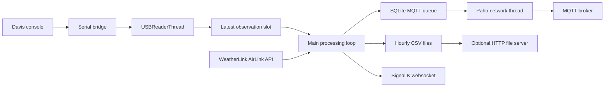

# Architecture and execution model

[Documentation index](README.md)

## System boundary

The publisher accesses the console through a TCP endpoint constructed as `tcp:127.0.0.1:<usbPort>`. The USB terminology in configuration names describes the physical installation rather than the Python interface: the process itself connects to a loopback network service. A separate serial bridge, commonly ser2net, owns the physical serial device.



The diagram represents logical data flow. The HTTP server actually exposes its configured directory, which can include files other than CSV. The AirLink request and Signal K operations execute synchronously in the main thread.

## Acquisition and selection

`USBReaderThread` creates a `VantagePro2` device, calls `get_current_data_as_json()`, applies the parameter map, and stores the resulting dictionary under a lock. A successful, nonempty filtered observation replaces the previous observation and increments a sequence counter. The reader waits `usbPollInterval` after each successful read. Connection or read failures close the device where applicable and introduce a one-second retry wait.

The shared state is a single latest-observation slot, not a queue of raw measurements. If the reader produces several observations before the main thread inspects that slot, only the most recent is available for processing. This is intentional behavior of the current implementation and must be considered when interpreting sampling density. It is neither an average nor a lossless archive of console reads.

The main thread processes an observation only when its sequence differs from the last processed sequence. A station interruption therefore does not cause the same record to be repeatedly published. However, there is no age threshold that rejects a previously unseen observation: a delayed main loop can still process the latest available record after a long pause.

## Main-loop responsibilities

For each new observation, the main loop preserves the selected console `Datetime` as `DatetimeWS`, assigns a new UTC `Datetime`, and adds the configured station name and position. It refreshes AirLink data when due and merges available AirLink fields. It then constructs both MQTT and Signal K representations, even when a corresponding transport is disabled.

In normal mode, CSV storage precedes MQTT queue insertion; Signal K publishing follows. Queue advancement occurs after observation processing, including cycles in which no new observation exists. There is no transaction spanning these outputs. A record can be stored locally but fail to reach a remote output, or reach a remote output after a local write failure.

In dry mode, the loop logs generated representations, waits for `delay`, and proceeds to the next cycle. Console acquisition remains active. AirLink, MQTT, Signal K network activity, the queue database, CSV writes, and the HTTP server are disabled by dry mode, but an explicitly configured log file can still be written.

## Timing model

Let `R` denote console read duration, `P` the configured `usbPollInterval`, `W` main-loop work duration, and `D` the configured `delay`. Approximate cycle durations are:

```text
reader cycle ≈ R + P
main cycle   ≈ W + D
```

Neither interval defines a strict sampling frequency. Disk operations, connection establishment, AirLink requests, and Signal K security checks contribute to `W`. Signal K checks may issue several HTTP requests, each subject to its own timeout. The reader can continue while the main thread waits for these operations, but intermediate observations may be overwritten in the latest slot.

Observation age tracking, queue timestamps, and integration retry scheduling use wall-clock time. Clock corrections can consequently affect age calculations and retry deadlines. The sequence counter, rather than a timestamp comparison, is what prevents repeated processing of the same reader result.

## MQTT concurrency

Paho manages network traffic in its own thread through `loop_start()`. Connection callbacks update the online flag; they do not drain SQLite. The main thread alone owns the dictionary of pending publish-result objects and advances at most one batch of 200 queue records per cycle.

A successful call to `publish()` registers the result as pending. A later cycle checks completion and removes confirmed records from SQLite. This separation lets the Paho network thread process acknowledgments while the main thread continues other work. Protocol completion is interpreted through the documented [Paho publish-result interface](https://eclipse.dev/paho/files/paho.mqtt.python/html/client.html#paho.mqtt.client.MQTTMessageInfo).

## Startup and shutdown

Startup loads configuration and parameters, normalizes configuration values, prepares enabled outputs, performs an initial Signal K access check if needed, and starts the console reader. Configuration and most settings are not reloaded during operation. Signal K token persistence updates the configuration file, but it is not a general hot-reload mechanism.

SIGINT and SIGTERM set a shared stop event once signal handlers have been installed. Cleanup waits up to three seconds for the daemon reader, stops MQTT, closes Signal K, and shuts down the HTTP server. These are best-effort cleanup steps: a blocking operation can delay entry into cleanup, and an active console read can exceed the reader join interval. There is no final guaranteed drain of the MQTT queue; retained SQLite records support a later restart.

Implementation basis: [`USBReaderThread`, `main`, and MQTT functions](../vantage-publisher.py).
